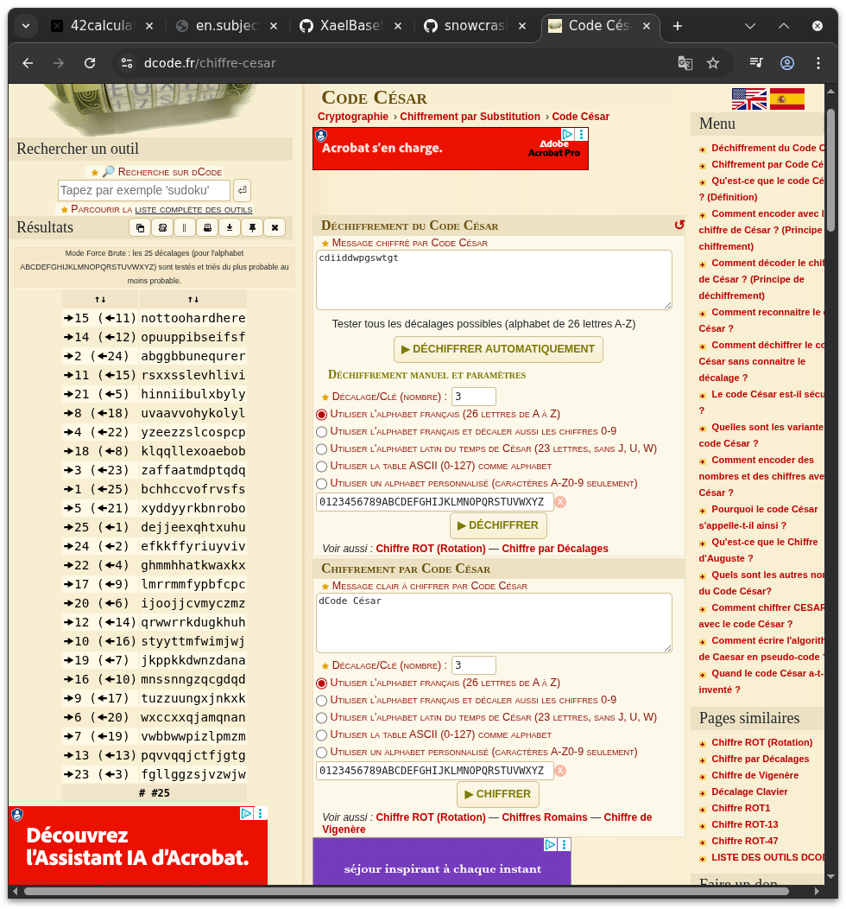
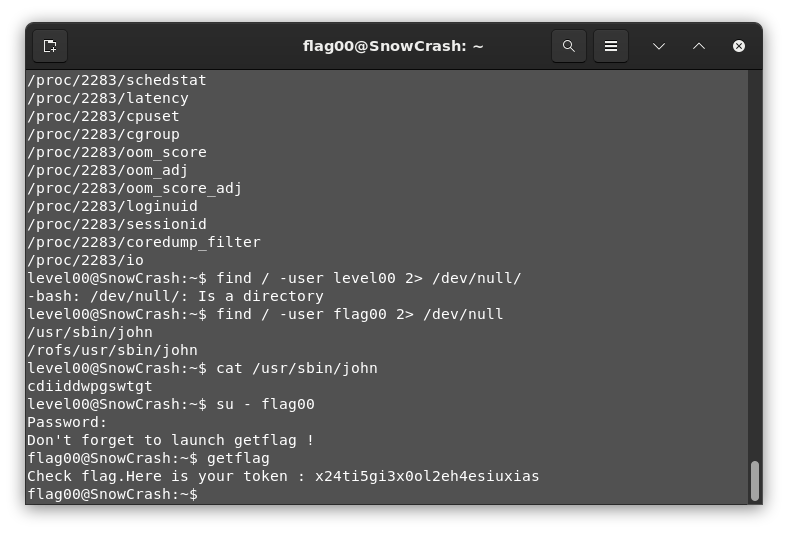

# Level 00 -

First thing we check the basic info we have an user

```bash
$ pwd
/home/user/level00

$ whoami
level00

$ ls -Al
-r-xr-x---+ 1 level00 level00  220 Apr  3  2012 .bash_logout
-r-xr-x---+ 1 level00 level00 3518 Aug 30  2015 .bashrc
-r-xr-x---+ 1 level00 level00  675 Apr  3  2012 .profile
```

Nothing interesting. 

What files have I access to ?

```bash
$ find / -user flag00 # returns the file owned by the user flag00
/usr/sbin/john
/rofs/usr/sbin/john

$ cat /usr/sbin/john
cdiiddwpgswtgt

$ cat /rofs/usr/sbin/john
cdiiddwpgswtgt
```

Interesting, the flag looks cyphered, it does not work as a password. Let's try a rot 13 ? Did not returns anything of use.
A Caesar code returns `notoohardhere` which seems the most probable.



My reasonning for using this cypher is based on the fact that those are the only two I know of.

Success!
