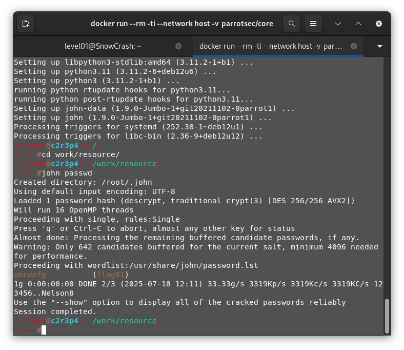
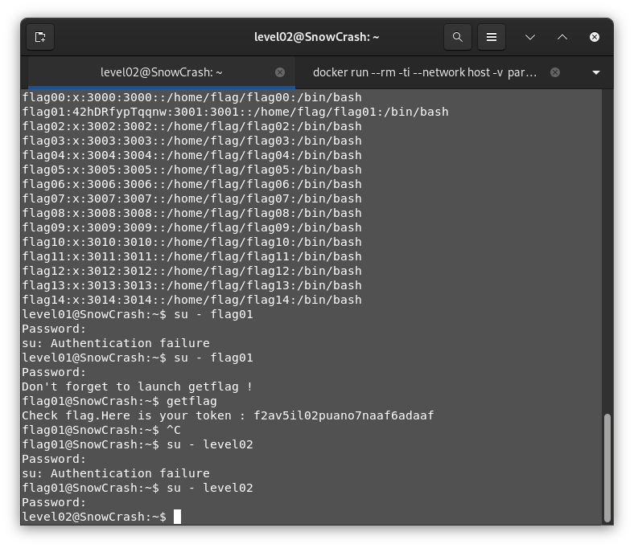

# Level 01 -

We check the information of the user

```bash
$ pwd
/home/user/level01

$ ls -Al
total 12
-r-x------ 1 level01 level01  220 Apr  3  2012 .bash_logout
-r-x------ 1 level01 level01 3518 Aug 30  2015 .bashrc
-r-x------ 1 level01 level01  675 Apr  3  2012 .profile

$ find / -user flag01 2> /dev/null

```

We know the user informations, crypted obviously, are present in the `/etc/passwd` and the password in itself is stored `/etc/shadow`, crypted of course. Both of these files are accessible only by strict file permissions.

```bash
$ ls -l /etc/shadow
-rw-r----- 1 root shadow 4428 Mar  6  2016 /etc/shadow
$ ls -l /etc/passwd
-rw-r--r-- 1 root root 2477 Mar  5  2016 /etc/passwd # So everyone can read it :)

$ cat /etc/passwd
flag01:42hDRfypTqqnw:3001:3001::/home/flag/flag01:/bin/bash # The line that interess us
```

So the password is hashed, but accessible anyways... Let's decrypt it. In order to break it, let's use johntheripper.

We first download the file with `scp -p 4242 level01@10.12.200.118:/etc/passwd ./Documents/Codes/snow-crash/mandatory/level01/resource` on the host.

Let's use a docker image to crack the password. 
```bash
$ docker run --rm -ti --network host -v $PWD/Documents/Codes/snow-crash/mandatory/level01:/work parrotsec/core
$[root] apt-get update && apt-get install john -y
$[root] cd work/resource
$[root] john --show passwd
flag01:abcdefg:3001:3001::/home/flag/flag01:/bin/bash
```

which decrypt the hashed password as 

with that, we get the flag and success
