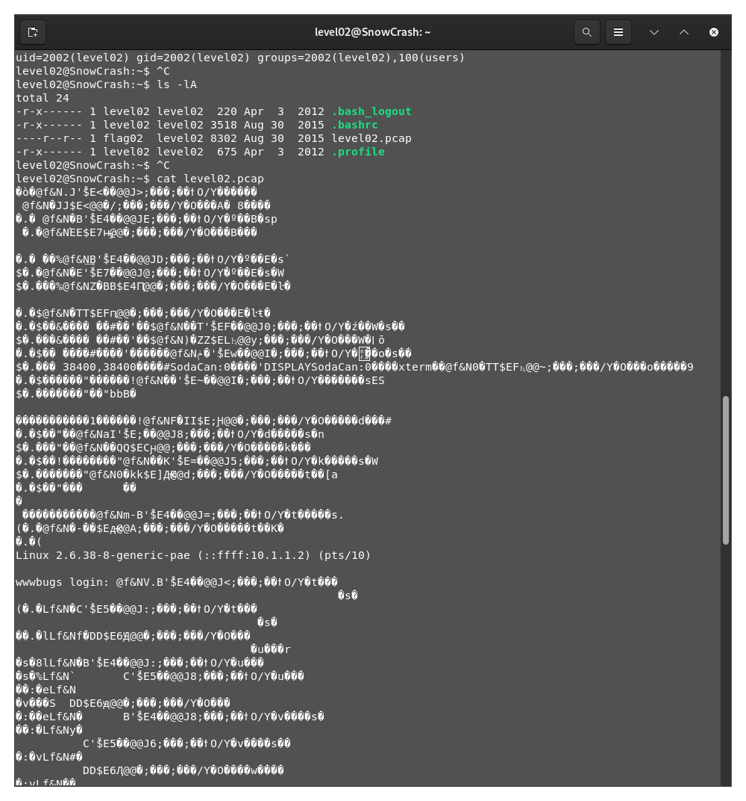
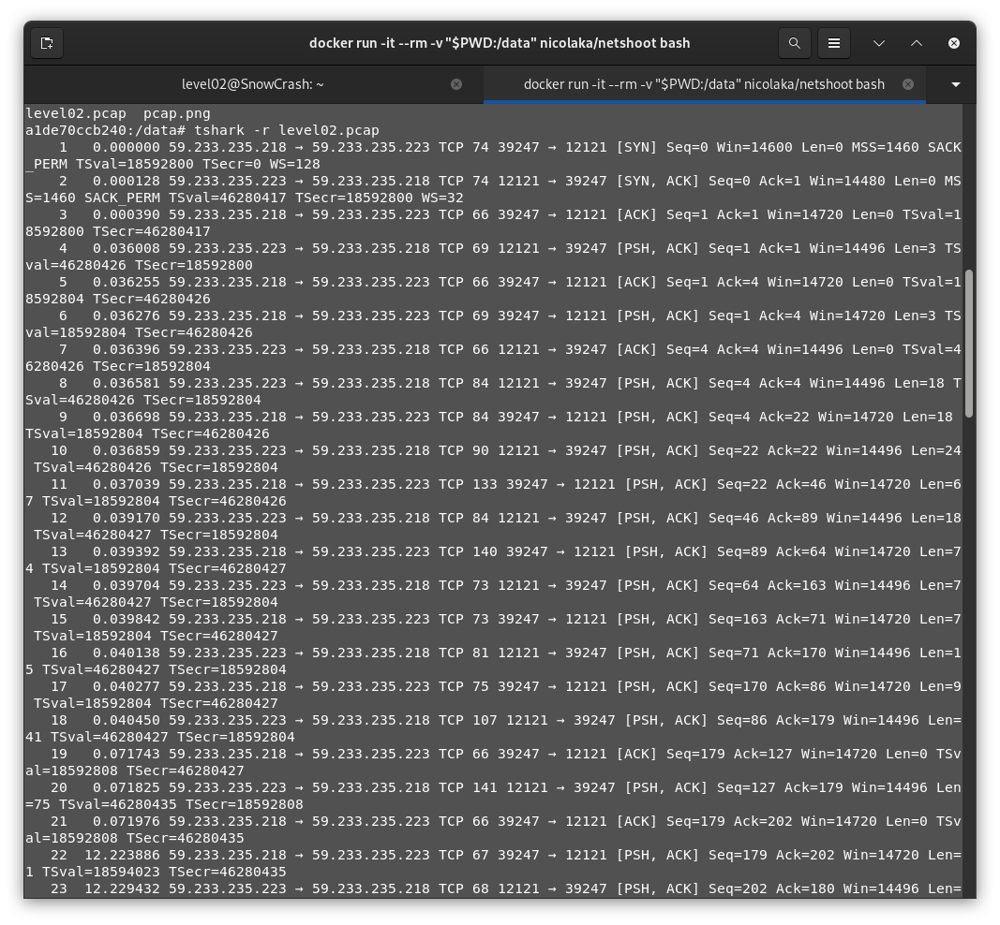
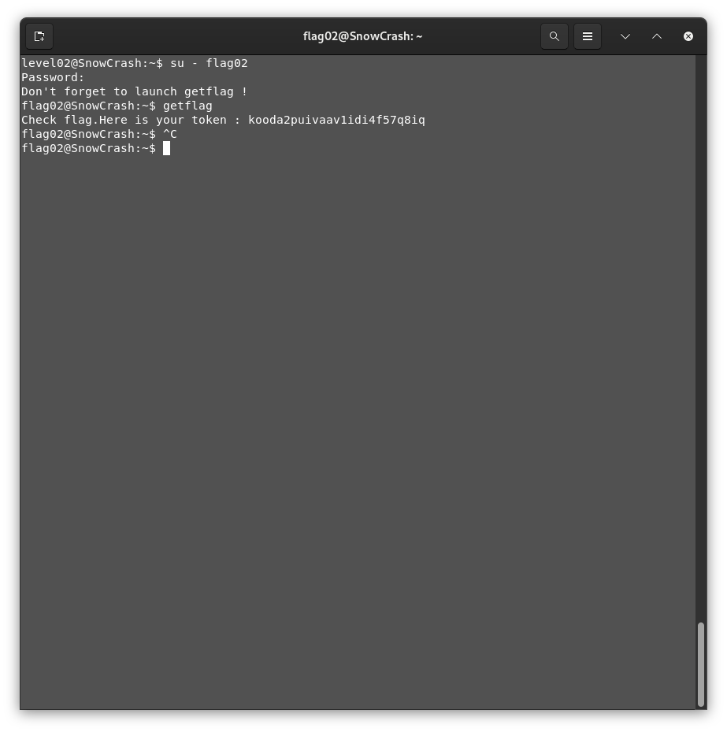

# Level02 - TCP Traces

Who could I be, where could I be ?

```bash
$ pwd
/home/user/level02
$ whoami
level02
$ id
uid=2002(level02) gid=2002(level02) groups=2002(level02),100(users)
$ ls -lA
----r--r-- 1 flag02  level02 8302 Aug 30  2015 level02.pcap #well, that was easy.
```


I would like to apologize...

So a quick google research later, and I know that a PCAP file is a format used to save network data and can be read with tools like wireshark or TCPdump.

So let's use the `nicolaka/netshoot` docker image to analyze the file:

```bash
$ docker run -it --rm -v "$PWD:/data" nicolaka/netshoot bash
a1de70ccb240:/data$ tshark -r level02.pcap 
```

which give us the self explanatory following



Thanksfully, with `tshark` (the CLI of Wireshark) we can decrypt it into the stream0.txt with the command 
```bash
tshark -r level02.pcap -z follow,tcp,ascii,0 > stream0.txt
# -r : read from a file
# -z follow,tcp,ascii,0: generate stats outputs by reconstructing the TCP stream and format it using ASCII characters.
```

The file, as such, contains all the keystrokes used.

By reconstructing the file manually, we get the password `ft_wandr...NDRel.L0L`.

Trying it returns an error, so let's check with hex characters.
Turns out that the `.` found in the file is the 7F character, which is the `DEL`. By removing the `.` and the previous character (which are those getting deleted if you followed), we get the password is `ft_waNDReL0L`.

